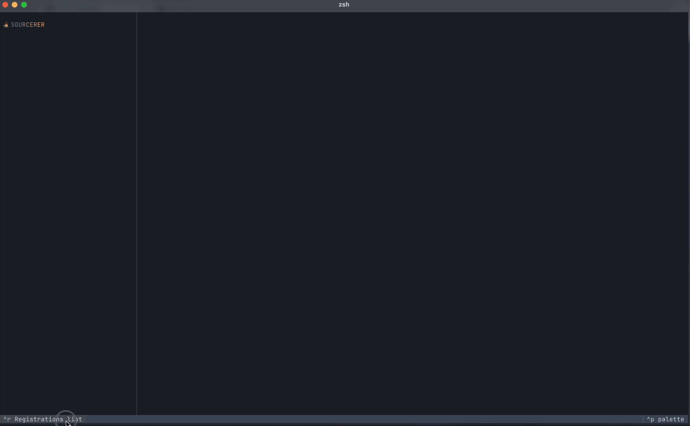
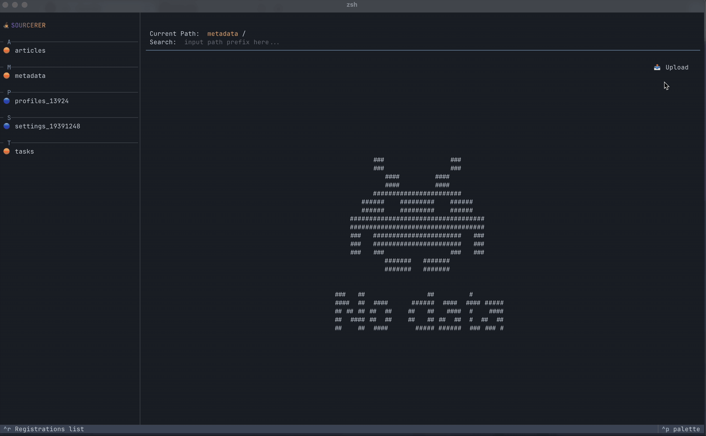

# 🧙‍♂️ Sourcerer

**Sourcerer** is a CLI-based cloud storage explorer that provides a unified interface for developers and DevOps 
engineers to view and manage files across multiple cloud providers like 
**GCP**, **AWS S3**, and **S3-compatible services**.

> Your terminal. Your storages. Your control.

---

## ✨ Features

- 🔍 Unified file browser for GCP, AWS S3, and S3-compatible services  
- 🧭 Terminal UI (TUI) built with [Textual](https://github.com/Textualize/textual)  
- 🗂️ Explore buckets and objects seamlessly  
- 🔄 Upload, download, and delete files  
- 🔐 Secure credential management via local **SQLite database**  

---

## 🪄 Installation

```bash
pip install sourcerer
```


## 🔮 See in action



